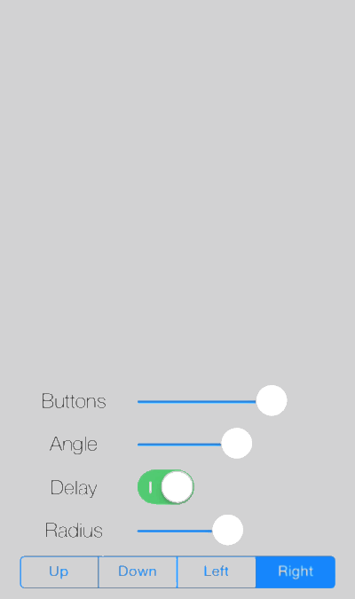

CKCircleMenuView
================

Well, it's a circle menu. Kind of. For iOS.

The idea is to keep your UI simple and clean and show buttons to the user when they are needed. The following screenshot is taken from the demo app I have provided in this repository. Simply clone this repo and call `pod install` within the CircleViewDemo folder.

The CKCircleMenuView is designed for easy integration and usage. Spawning the menu and reacting on button activations is as easy as to use an UIAlertView.

## Features

There are several options that can be adjusted before presenting the menu.

* Number of buttons (either provided as an array of images or as a dynamic parameter list of images)
* Button's normal color
* Button's active (or say hover) color
* Button's border color
* Angle to be used for button placement (default = 180 degrees)
* Direction of the angle's center (default = `CircleMenuDirectionUp`)
* Radius of the button alignment (default = 65)

## Usage

tbd.

For now, please take a look at the demo app to see how the CKCircleMenuView is used.

## Author

Christian Klaproth, [@JaNd3r](http://twitter.com/JaNd3r)

## License

CKCircleMenuView is available under the MIT license. See the LICENSE file for more info.
